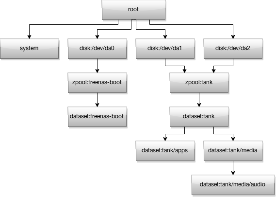

# dispatcher task processing

## Basic information

Task is the basic unit of work in dispatcher. It's a piece of code, running in separate thread interacting with the system, altering system state and providing feedback to user.

## Task scheduling

Tasks submitted to server are added onto a list and at that time, task verify() method is called. verify() should return list of resource names required for that task. That information is recorded and used in distribution thread. Distribution thread evaluates which resources are free to use and spawns task from waiting list accordingly. Tasks submitted earlier are typically scheduled first.

## Resource hierarchy

Tasks are synchronized using "resource tree". It's a directed acyclic graph (DAG) of locks representing certain resources. Each task needs to claim resources it want to use at "verify" stage. Locking one resource means whole sub-tree of resources under that one will be also locked.

Acquiring resource may fail if:

* Resource is already locked
* Any resource or any subtree of resources depending on that resource is already locked

Simple example of dispatcher resource tree:

Suppose we have a task operating on a dataset. It would acquire resource representing that dataset, eg. "tank" (root dataset of zpool having the same name):

"dataset:tank" resource and all dependent resources are locked, which means that no other task can acquire any of them until currently executed finishes. Also, it's not possible to acquire resource which has any busy resources in it's dependency subtree. For example, given situation from the diagram above, any task trying to claim "disk:/dev/da2" resource would wait until "dataset:tank" and all other dependent resources will be freed.

## Task Interface

All tasks should derive from base class `tasks.Task`.

### Mandatory methods:

#### `describe(self, args...)`

Return human readable task description as string. That doesn't need to be localizable, it's used by debugging purposes only.

#### `verify(self, args...)`

Verify whether provided task parameters are sane and compute list of resources needed for that task. Should return list of resources, eg. `["disk:/dev/da0", "disk:/dev/da1"]`

#### `run(self, args...)`

Run actual task.

### Optional methods:

Long-running tasks can implement following methods to provide user with task progress and possibility to abort a task in the middle (by default, task can't be aborted once started):

#### `get_status(self)`

Return progress information from a task.

#### `abort(self)`

Try to abort a task. If that succeeds, return `True`. If aborting failed, return `False`.

### Reporting failures

Failures at verify stage should be communicated by raising `task.VerifyException`. Failures at run stage should be reported by raising `task.TaskException`. However, all exceptions at both stages are catched and presented to user.